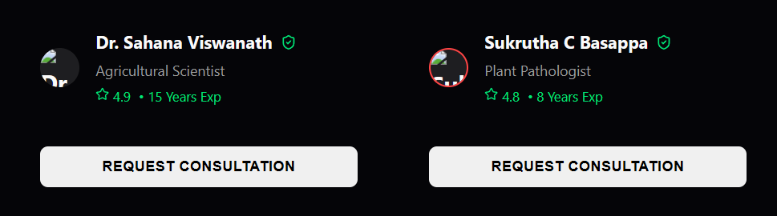

# 🌾 Krishi - AI-Powered Agriculture Assistant

[](https://reactjs.org/)
[](https://firebase.google.com/)
[](https://vitejs.dev/)

> **Built for the Modern Farmer 🚜**
> Instant Diagnosis • Real-Time Expert Consultations • Community Verified

## 📖 Overview

**Krishi** is a cutting-edge web application empowering farmers with AI-driven tools and real-time expert connections. By leveraging computer vision, Krishi instantly diagnoses crop diseases and provides scientifically-backed remedies. 

Beyond AI, Krishi bridges the gap between technology and traditional farming by facilitating **Live Real-Time Consultations** between farmers and certified agricultural experts using a modern, glassmorphism-inspired UI.



---

## ✨ Key Features

| Feature | Description |
| :--- | :--- |
| 🤖 **AI Instant Scan** | Advanced AI identifies plant diseases from a simple photo in seconds. |
| 🧑‍⚕️ **Live Consultations** | Farmers can request and connect with verified agricultural experts in real-time. |
| 💬 **Real-Time Chat Engine** | A built-in messaging system synced via Firestore for seamless Farmer-to-Expert communication. |
| 🔒 **Role-Based Authentication** | Secure phone-number (OTP) login powered by Firebase Auth, intelligently routing Users to Farmer or Expert dashboards. |
| 🕵️ **Guest / Interviewer Mode** | 1-click anonymous login for recruiters and interviewers to securely test the app without a phone number. |
| 💊 **Smart Remedies** | Get precise chemical and organic treatment plans tailored to the diagnosed disease. |
| 🗣️ **Multilingual Support** | Native support for English, Hindi, and Kannada for maximum accessibility. |

---

## 🛠️ Tech Stack

**Frontend Architecture:**
* **Framework:** React + Vite
* **Styling:** Vanilla CSS (Custom Glassmorphism UI), CSS Modules
* **Animations:** Framer Motion
* **Icons:** Lucide React

**Backend & Database:**
* **Database:** Firebase Firestore (Real-time NoSQL)
* **Authentication:** Firebase Auth (Phone OTP, Anonymous Sign-In)
* **Legacy API:** Node.js / Express.js / MongoDB (For legacy features)

---

## 🚀 Application Flow

1. **Role Selection:** Choose to enter the platform as a Farmer or an Expert. Interviewers can bypass OTP using the **Guest Login** feature.
2. **Scan Crop:** Upload or capture a photo of the affected crop to receive an immediate diagnosis.
3. **Get Treatment:** View AI-recommended chemical and organic remedies.
4. **Consult an Expert:** If further help is needed, browse available experts and send a real-time consultation request.
5. **Live Chat:** Experts receive the request on their dynamic dashboard, accept it, and a live Firestore chat room is instantiated instantly.

---

## 📂 Project Structure

```text
Krishi/
├── 📱 frontend-new/          # React Client (Vite)
│   ├── src/
│   │   ├── components/       # Reusable UI (Navbar, ChatBot, etc.)
│   │   ├── context/          # Global State (AuthContext for Firebase)
│   │   ├── pages/            # Core Routes (Consult, ExpertDashboard, Login, etc.)
│   │   └── utils/            # Configs (firebase.js)
├── 🖥️ backend/               # Legacy API Server
│   ├── models/               # Mongoose Schemas
│   └── routes/               # API Endpoints
└── 📄 README.md              # Project Documentation
```

---

## ⚡ Getting Started

### Prerequisites
* Node.js (v18+)
* A Firebase Project (with Auth and Firestore enabled)

### Installation Guide

1. **Clone the Repository**
   ```bash
   git clone https://github.com/yourusername/krishi.git
   cd krishi
   ```

2. **Frontend Setup**
   ```bash
   cd frontend-new
   npm install
   ```

3. **Environment Variables**
   Create a `.env` file in `frontend-new` with your Firebase Config:
   ```env
   VITE_FIREBASE_API_KEY=your_api_key
   VITE_FIREBASE_AUTH_DOMAIN=your_auth_domain
   VITE_FIREBASE_PROJECT_ID=your_project_id
   VITE_FIREBASE_STORAGE_BUCKET=your_storage_bucket
   VITE_FIREBASE_MESSAGING_SENDER_ID=your_sender_id
   VITE_FIREBASE_APP_ID=your_app_id
   ```

4. **Run the Application**
   ```bash
   npm run dev
   ```

---

## 📄 License
This project is open source and available under the MIT License.

Built with ❤️ for Indian Farmers
